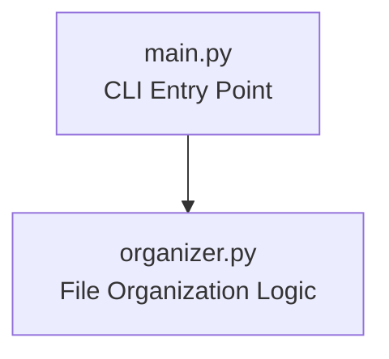

# Architecture

## Folder Structure

```text
src/
├── main.py
├── organizer.py
```

## Component Diagram



## Responsibilities

### main.py
- inicia ejecución
- importa función principal

### organizer.py
- recibe ruta del usuario
- valida directorio
- recorre archivos
- crea carpetas por extensión
- mueve archivos

### Execution Flow
main.py
↓
organizer_files()
↓
Validación de ruta
↓
Iteración de archivos
↓
Creación de carpetas
↓
Movimiento de archivos

### Design Notes

- arquitectura simple de 2 archivos
- separación básica entre entry point y lógica
- uso de pathlib para manejo moderno de archivos
- preparado para futuras mejoras sin complejidad innecesaria
